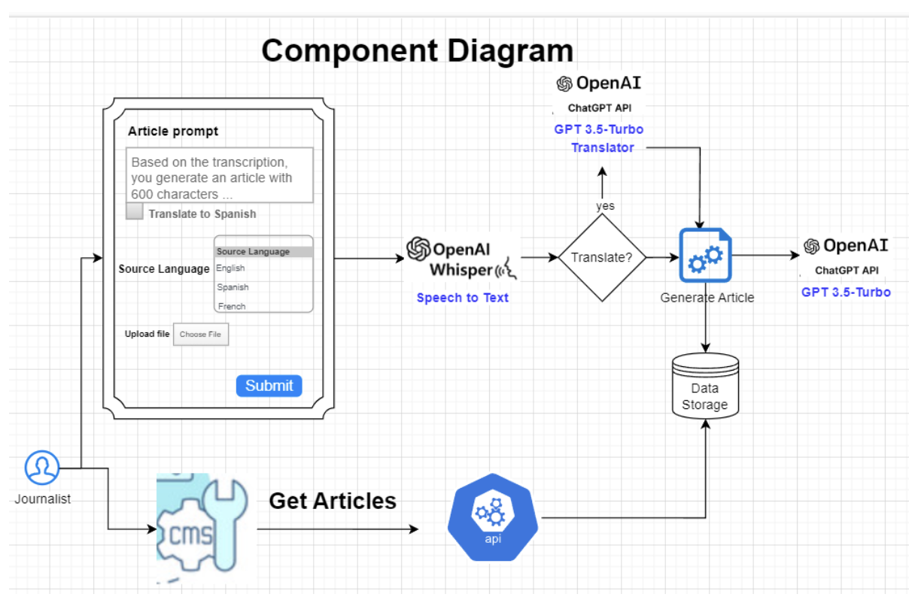
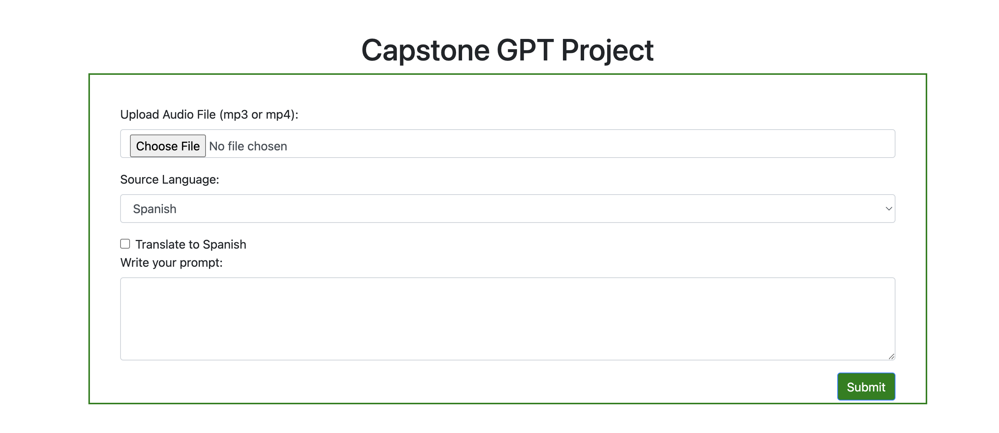

# Capstone Project

## Need

I work for a Spanish-language television channel with a network of associated web portals. We face three critical needs that could benefit from the implementation of artificial intelligence.

1. **Content Creation from Video Clips:**
   Firstly, the content creation process from video clips extracted from the broadcast signal requires journalists to listen to and analyze each clip to generate an article.

2. **Translation Challenge:**
   Secondly, we encounter the challenge of translating content from international news providers who send information in English or French. Currently, a person performs this translation so that journalists can draft articles.

3. **Journalistic Opinion Productions:**
   Finally, journalistic opinion productions require the generation of scripts based on interviews, which currently involves manual transcription of these.

## Actions to Complete

1. **Transcription Extraction:**
   - Extract the transcription from a multimedia file (mp3 or mp4).

2. **Translation Process:**
   - If the translation option is selected, translate it into Spanish based on the transcription in English or French.

3. **Content Generation:**
   - Generate a title, a summary, a list of tags, and an article based on the transcription and a prompt sent by the journalist. If the journalist does not send a prompt, it will be generated based on a generic prompt.

4. **Backend Development:**
   - Build a backend artifact to create an endpoint consumed by our CMS or a web client.

5. **Frontend Interface:**
   - Build a frontend form where the journalist can upload an mp3 or mp4 file, select the source language, choose whether to translate the transcription and input a prompt to generate the content.

## Component Diagram



## Execution this Docker Compose

1) Clone to this project

```bash
git clone git@github.com:munarmontoyavictor/chatgpt-capstone-project.git
```

2) Execute the Docker Compose instruction to launch Tech Stack (`Python`, `Flask` and `MongoDB`).

```bash
docker-compose up -d
```

3) Create the files `.env` and `app/.env` based on `.env.example.txt` and `app/.env.example.txt`.
   In app/.env, you must specify the OPENAI_API_KEY.

4) Runnnig containers and showing results.

### upload file form

**url {host}/transcribe**



### Get article by job id

**url {host}/api/transcribe/<job_id>**

```json
{
  "article": "LLM es más que...",
  "file_name": "file.mp4",
  "job_id": "657643ee9885d7de27865a4b",
  "message": "ok",
  "prompt": "",
  "source_language": "spanish",
  "summary": "Descubre cómo...",
  "tags": "LLM, comunicación, distribución de información, revolución digital",
  "title": "Revolucionando la Comunicación con LLM: Nuevas Formas de Distribuir y Presentar Información",
  "transcription": "¡Bienvenidos a esta sesión ...",
  "translate_to_spanish": true
}
```

### Get all articles

**url {host}/api/transcribe**
